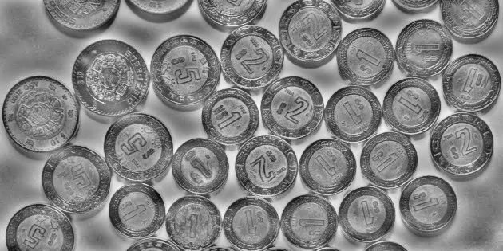
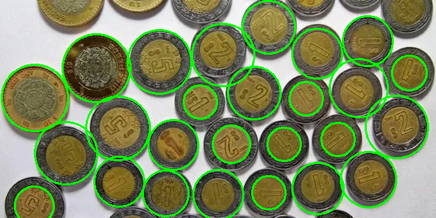

# 🪙 Contador de Monedas con OpenCV y Fourier

Este proyecto implementa un **contador automático de monedas** a partir de una imagen usando técnicas de **procesamiento digital de imágenes** en Python.  
Combina mejora de contraste local (CLAHE), filtrado en el dominio de Fourier, detección de círculos mediante Hough Transform adaptativa y clasificación basada en el tamaño físico de las monedas mexicanas.

---

## 📸 Ejemplo de uso

```bash
python contar_monedas.py --img dineros.webp --save salidas/resultado.png --target 25
```

- `--img` → Ruta a la imagen de entrada.  
- `--save` → (Opcional) Ruta de salida de la imagen anotada.  
- `--target` → (Opcional) Número esperado de monedas para ajustar la detección Hough.  

---

## 🧠 Pipeline del procesamiento

1. **CLAHE (Contrast Limited Adaptive Histogram Equalization)**  
   Mejora el contraste localmente en el canal L* (LAB), corrigiendo sombras o brillos.

2. **Filtro Pasa-Altas en el Dominio de Fourier**  
   Elimina componentes de baja frecuencia (fondo) y realza bordes circulares.

3. **Suavizado Gaussiano**  
   Reduce el ruido antes de aplicar la detección de círculos.

4. **Detección de círculos con HoughCircles (barrido adaptativo)**  
   Prueba distintos valores de sensibilidad (`param2`, `minDist`) hasta encontrar la mejor detección según `--target`.

5. **NMS (Non-Maximum Suppression)**  
   Elimina duplicados de detecciones solapadas.

6. **Clasificación por tamaño físico (1, 2, 5, 10 pesos)**  
   Usa relaciones reales de diámetros en milímetros, aplicando **umbrales sesgados** para evitar sobreclasificación.

7. **Visualización y salida**  
   Dibuja los círculos detectados y etiquetas de denominación, y muestra un resumen con el valor total.

---

## 💾 Imágenes generadas automáticamente

Durante la ejecución, el script guarda imágenes intermedias en la carpeta `salidas/`:

| Etapa | Archivo generado |
|:------|:-----------------|
| Contraste mejorado (CLAHE) | `1_contraste_CLAHE.png` |
| Realce de bordes (Fourier) | `2_pasa_altas.png` |
| Imagen suavizada | `3_suavizado.png` |
| Círculos detectados | `4_circulos_detectados.png` |
| Imagen final anotada | la ruta definida en `--save` |

---

## 🧰 Requisitos

- Python ≥ 3.8  
- OpenCV ≥ 4.5  
- NumPy ≥ 1.22  

### Instalación rápida

```bash
pip install opencv-python numpy
```

---

## 🧩 Estructura del proyecto

```
.
├── contar_monedas.py      # Script principal documentado
├── salidas/               # Imágenes intermedias y resultados
├── dineros.webp           # Imagen de prueba (no incluida)
└── README.md
```

---

## ⚙️ Parámetros de sesgo (configuración ajustable)

En la cabecera del script puedes modificar los valores de sesgo para ajustar la clasificación:

```python
BIAS_UMBRAL_1_VS_2 = 1.70
BIAS_UMBRAL_2_VS_5 = 2.4975
BIAS_UMBRAL_5_VS_10 = 1.90
```

Valores mayores favorecen clasificar hacia la moneda de **menor denominación**.

---

## 🧮 Salida en consola

```
--- RESUMEN ---
1 Peso: 15
2 Pesos: 4
5 Pesos: 5
10 Pesos: 2
Total detectado: 26 monedas
Valor total aproximado: $68 MXN
```

---

## 📂 Ejemplo visual del resultado

| Etapa | Ejemplo |
|-------|----------|
| Fourier High-Pass |  |
| Círculos detectados |  |
| Resultado final |  |

---

## 🧾 Licencia

Proyecto libre bajo licencia MIT.  
Creado por **Angel "Taco" Becerra** como práctica de procesamiento de imágenes con Python y OpenCV.

---

## 🚀 Notas

- Funciona mejor con **imágenes tomadas perpendicularmente** y **buena iluminación**.  
- Si detecta monedas dobles o faltantes, ajusta `--target` o los sesgos `BIAS_UMBRAL_*`.  
- Compatible con imágenes `.jpg`, `.png`, `.webp`.

---

### ✨ Ejecución rápida (modo completo)

```bash
python contar_monedas.py --img dineros.webp --save salidas/resultado.png --target 25
```
El programa generará automáticamente todos los pasos intermedios en `salidas/` y mostrará el conteo en consola.
